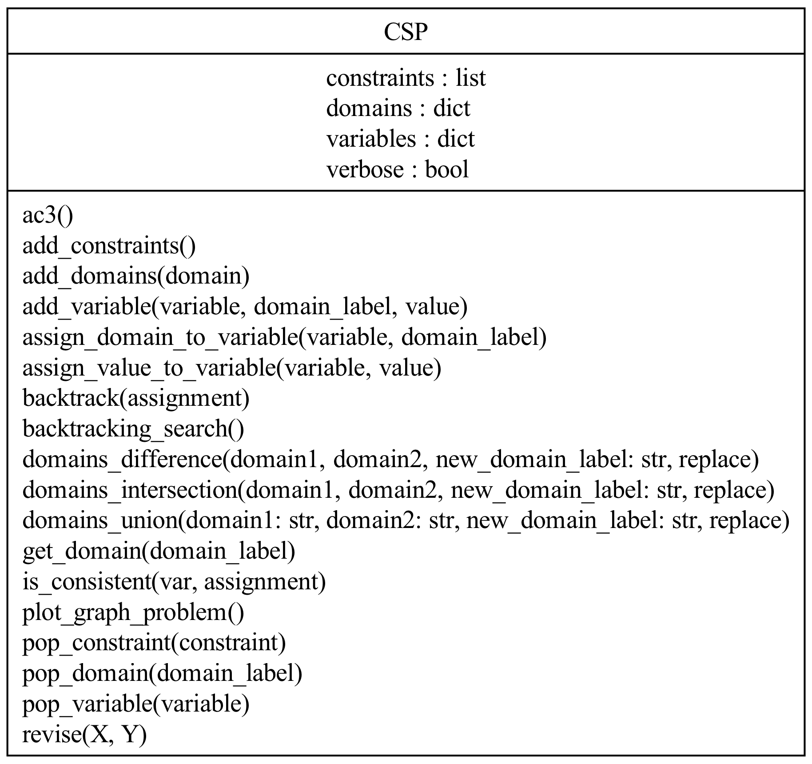
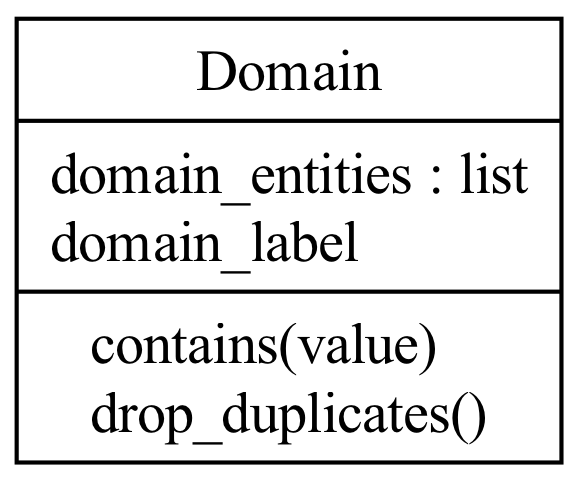
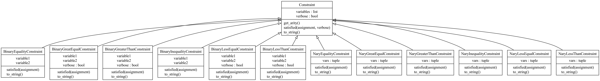

# Constraint satisfaction problem (CSP)

This module implements some classes in order to solve CSP problems.

Currently, it supports:

- Domain handling: union, intersection, difference
- AC-3 and REVISE algorithms for arc consistency
- Backtracking search algorithm
- Graph visualization of the CSP problem using `netowkrx`
- Main constraints: equality, inequality, less than, greater than, and their n-ary versions

## Usage

```shell
# try the class on a simple example
python test.py
```

```python
# How to import the module
from CSP.csp import CSP         # Import CSP class
from CSP.domain import Domain   # Import Domain class
from CSP.constraint import *    # Import all available constraints
```

## Dependencies

- `nx`, for graph visualization
- `matplotlib`, for graph visualization

## Implemented methods

### CSP class

- `__init__(self, variables=None, domains=None, constraints=None, verbose=True)`
- `get_domain(self, domain_label)`
- `add_constraints(self, *constraints)`
- `add_variable(self, variable=str, domain_label=None, value=None)`
- `assign_value_to_variable(self, variable, value)`
- `assign_domain_to_variable(self, variable, domain_label)`
- `add_domains(self, domain)`
- `pop_domain(self, domain_label)`
- `pop_variable(self, variable)`
- `pop_constraint(self, constraint)`
- `domains_union(self, domain1, domain2, new_domain_label, replace=False)`
- `domains_intersection(self, domain1, domain2, new_domain_label, replace=False)`
- `domains_difference(self, domain1, domain2, new_domain_label, replace=False)`
- `revise(self, X, Y)`
- `ac3(self)`
- `backtracking_search(self)`
- `backtrack(self, assignment)`
- `is_consistent(self, var, assignment)`
- `plot_graph_problem(self)`

### Domain class

- `__init__(self, variables: list, verbose=False)`
- `satisfied(self, assignment, verbose=False)`
- `get_arity(self)`
- `to_string(self)`

### Constraint class

#### `BinaryInequalityConstraint`

- `__init__(self, variable1, variable2)`
- `satisfied(self, assignment)`
- `to_string(self)`

#### `BinaryEqualityConstraint`

- `__init__(self, variable1, variable2)`
- `satisfied(self, assignment)`
- `to_string(self)`

#### `BinaryLessThanConstraint`

- `__init__(self, variable1, variable2, verbose=False)`
- `satisfied(self, assignment)`
- `to_string(self)`

#### `BinaryLessEqualConstraint`

- `__init__(self, variable1, variable2, verbose=False)`
- `satisfied(self, assignment)`
- `to_string(self)`

#### `BinaryGreaterThanConstraint`

- `__init__(self, variable1, variable2, verbose=False)`
- `satisfied(self, assignment)`
- `to_string(self)`

#### `BinaryGreatEqualConstraint`

- `__init__(self, variable1, variable2, verbose=False)`
- `satisfied(self, assignment)`
- `to_string(self)`

#### `NaryInequalityConstraint`

- `__init__(self, *variables)`
- `satisfied(self, assignment)`
- `to_string(self)`

#### `NaryEqualityConstraint`

- `__init__(self, *variables)`
- `satisfied(self, assignment)`
- `to_string(self)`

#### `NaryLessThanConstraint`

- `__init__(self, *variables)`
- `satisfied(self, assignment)`
- `to_string(self)`

#### `NaryLessEqualConstraint`

- `__init__(self, *variables)`
- `satisfied(self, assignment)`
- `to_string(self)`

#### `NaryGreatEqualConstraint`

- `__init__(self, *variables)`
- `satisfied(self, assignment)`
- `to_string(self)`

#### `NaryGreaterThanConstraint`

- `__init__(self, *variables)`
- `satisfied(self, assignment)`
- `to_string(self)`


## UML Class Diagrams

> CSP problem UML



> Domain class UML



> Constraints UML



## Author

Emilio Garzia, 2025